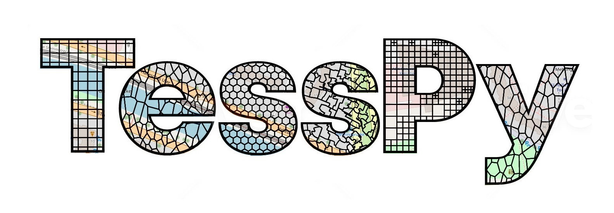
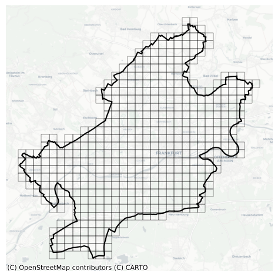
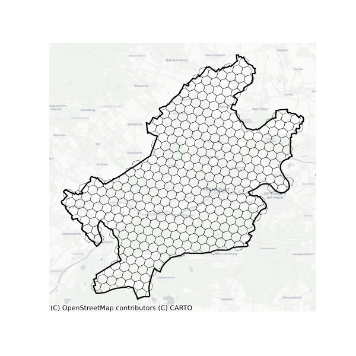
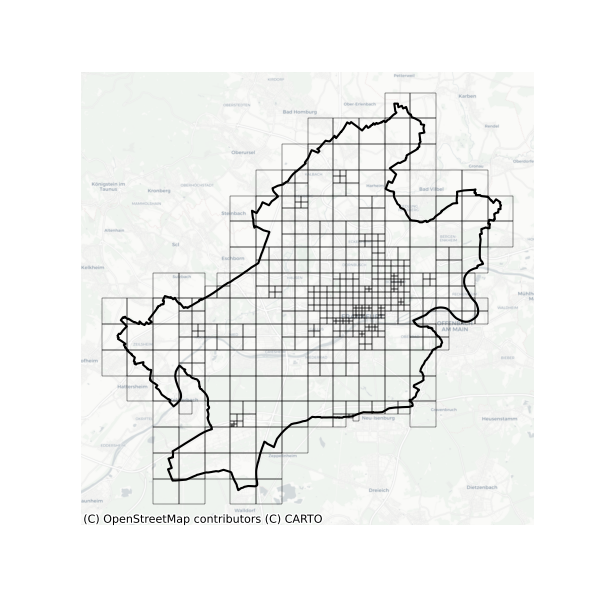
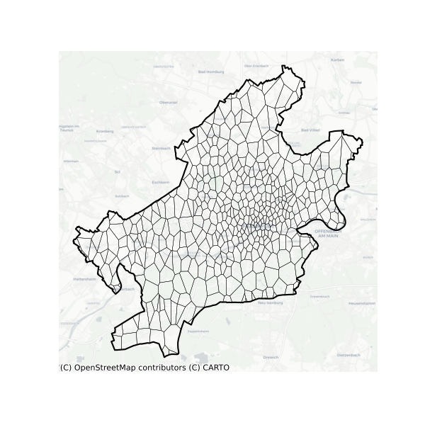
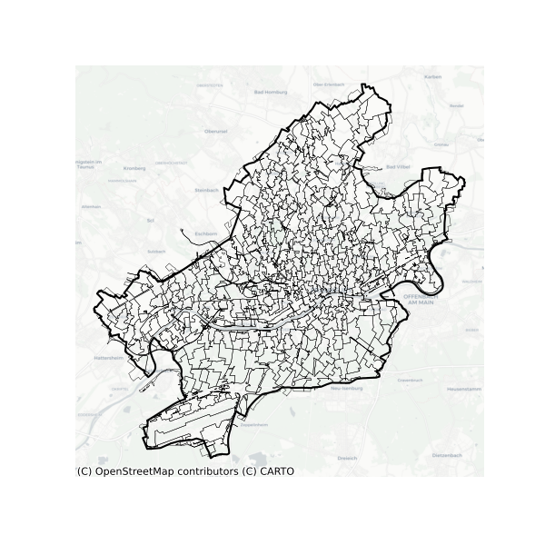

# tesspy
[](https://github.com/siavash-saki/tesspy/actions/workflows/tests_package.yml)
[](https://www.repostatus.org/#active)
[](https://tesspy.readthedocs.io/en/latest/?badge=latest)

[](https://anaconda.org/conda-forge/tesspy)



`tesspy` is a python library for geographical tessellation.

The process of discretization of space into subspaces without overlaps and gaps is called tessellation and is of interest to researchers in the field of spatial analysis. Tessellation is essential in understanding geographical space and provides a framework for analyzing geospatial data. Different tessellation methods are implemented in `tesspy`. They can be divided into two groups. The first group is regular tessellation methods: square grid and hexagon grid. The second group is irregular tessellation methods based on geospatial data. These methods are adaptive squares, Voronoi diagrams, and city blocks. The geospatial data used for tessellation is retrieved from the OpenStreetMap database.


## Installation

Install `tesspy` using [uv](https://docs.astral.sh/uv/) (**Recommended**):
```shell
uv pip install tesspy
```

or using pip:
```shell
pip install tesspy
```

`tesspy` is also available on conda-forge:
```shell
conda install -c conda-forge tesspy
```

## Creating a new environment for tesspy

We recommend using uv to create and manage a virtual environment:

```shell
uv venv tesspy_env
source tesspy_env/bin/activate  # Linux/macOS
# tesspy_env\Scripts\activate   # Windows
uv pip install tesspy
```

To also install dependencies for running the example notebooks:

```shell
uv pip install "tesspy[examples]"
```

## Dependencies

`tesspy`'s dependencies are: `geopandas`, `scipy`, `h3-py`, `osmnx`, `hdbscan`, `mercantile`, `matplotlib` and `scikit-learn`.


## Documentation
The official documentation is hosted on **[ReadTheDocs](https://tesspy.readthedocs.io)**.

## Logging
`tesspy` uses Python's standard `logging` module. By default, library logging is
silent unless you configure it.

Basic progress logs:
```python
from tesspy import Tessellation, configure_logging

configure_logging("INFO")
t = Tessellation("Frankfurt am Main")
t.city_blocks(verbose=True)
```

Use `verbose=True` on POI-driven methods to emit progress events.


## Examples
The city of "Frankfurt am Main" in Germany is used to showcase different tessellation methods. This is how a tessellation object is built, and different methods are called. For the tessellation methods based on Points of Interests (adaptive squares, Voronoi polygons, and City Blocks), we use `amenity` data from the OpenStreetMap.
```python
from tesspy import Tessellation
ffm= Tessellation('Frankfurt am Main')
```


### Squares 
```python
ffm_sqruares = ffm.squares(resolution=15)
```


### Hexagons
```python
ffm_hex_8 = ffm.hexagons(resolution=8)
```



### Adaptive Squares
```python
ffm_asq = ffm.adaptive_squares(start_resolution=14, threshold=100, poi_categories=['amenity'])
```



### Voronoi Polygons
```python
ffm_voronoi = ffm.voronoi(poi_categories=['amenity'], n_polygons=500)
```


### City Blocks
```python
ffm_city_blocks = ffm.city_blocks(n_polygons=500)
```


## Citing Tesspy

We would be very grateful if you would cite Tesspy in your scientific publications. Please feel free to use the following citation for this purpose: 
Saki et al., (2022). TessPy: a python package for geographical tessellation. Journal of Open Source Software, 7(76), 4620, https://doi.org/10.21105/joss.04620

or the bibtex citation directly:
```{bibtex}
@article{Saki2022, 
        doi = {10.21105/joss.04620}, 
        url = {https://doi.org/10.21105/joss.04620}, 
        year = {2022}, 
        publisher = {The Open Journal}, 
        volume = {7}, 
        number = {76}, 
        pages = {4620}, 
        author = {Siavash Saki and Jonas Hamann and Tobias Hagen}, 
        title = {TessPy: a python package for geographical tessellation}, 
        journal = {Journal of Open Source Software}}
```


## Contributing to tesspy
All kind of contributions are welcome:
* Improvement of code with new features, bug fixes, and  bug reports
* Improvement of documentation
* Additional tests

To set up a development environment, clone the repo and install in editable mode:

```shell
git clone https://github.com/siavash-saki/tesspy.git
cd tesspy
uv pip install -e ".[dev,examples]"
```

Follow the instructions [here](https://tesspy.readthedocs.io/en/latest/Contribution.html)
for submitting a PR.

If you have any ideas or questions, feel free to open an issue.


## Acknowledgements
`tesspy` is the result of the research project [ClusterMobil](https://www.frankfurt-university.de/de/hochschule/fachbereich-1-architektur-bauingenieurwesen-geomatik/forschungsinstitut-ffin/fachgruppen-des-ffin/fg-neue-mobilitat/relut/forschungsprojekte-relut/clustermobil/) conducted by the [Research Lab for Urban Transport](https://www.frankfurt-university.de/en/about-us/faculty-1-architecture-civil-engineering-geomatics/research-institute-ffin/specialist-groups-of-the-ffin/specialist-group-new-mobility/relut/). This research project is funded by the state of Hesse and [HOLM](https://frankfurt-holm.de/) funding under the “Innovations in Logistics and Mobility” measure of the Hessian Ministry of Economics, Energy, Transport and Housing. [HA Project No.: 1017/21-19]
