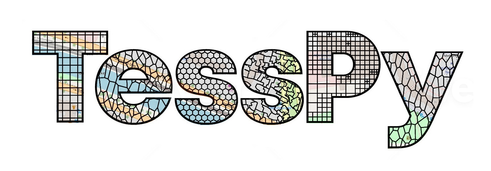
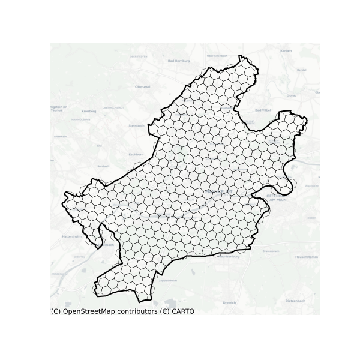
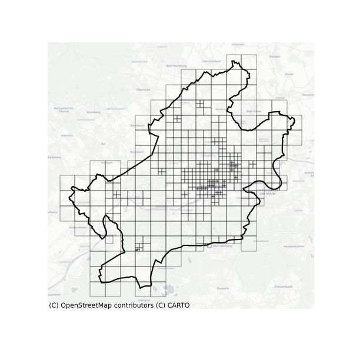
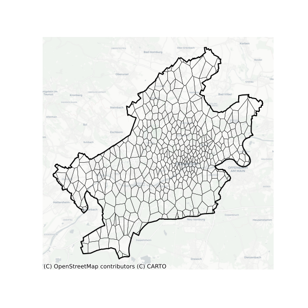
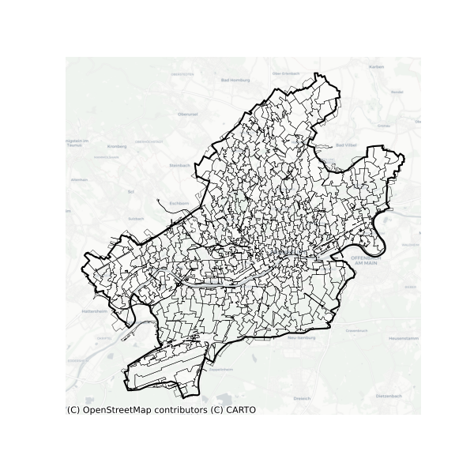

.. tesspy documentation master file, created by
   sphinx-quickstart on Fri Feb 18 09:12:00 2022.
   You can adapt this file completely to your liking, but it should at least
   contain the root `toctree` directive.

Welcome to tesspy's documentation!
++++++++++++++++++++++++++++++++++++

Introduction
==============

``tesspy`` is a python library for geographical tessellation.

The process of discretization of space into subspaces without overlaps and gaps is called tessellation. Tessellation is essential in understanding geographical space and provides a framework for analyzing geospatial data. Different tessellation methods are implemented in `tesspy`. They can be divided into two groups. The first group is regular tessellation methods: square grid and hexagon grid. The second group is irregular tessellation methods based on geospatial data. These methods are adaptive squares, Voronoi diagrams, and city blocks. The geospatial data used for tessellation is retrieved from the OpenStreetMap database.

The package is currently maintained by `@siavash-saki <http://github.com/siavash-saki>`_ and `@JoHamann <http://github.com/JoHamann>`_.

https://github.com/siavash-saki/tesspy

Install
=========
You can install ``tesspy`` from PyPI using pip (**Not Recommended**)::

   pip install tesspy

and from conda (**Recommended**)::

   conda install tesspy

Creating a new environment for tesspy
=======================================
``tesspy`` depends on ``geopandas``, which could make the installation sometimes tricky because of the conflicts with the current packages. Therefore, we recommend creating a new clean environment and installing the dependencies from the conda-forge channel.

Create a new environment::

   conda create -n tesspy_env -c conda-forge

Activate this environment::

   conda activate tesspy_env

Install tesspy from conda-forge channel::

   conda install -c conda-forge tesspy

Examples
========
The city of "Frankfurt am Main" in Germany is used to showcase different tessellation methods. This is how a tessellation object is built, and different methods are called. For the tessellation methods based on Points of Interests (adaptive squares, Voronoi polygons, and City Blocks), we use ``amenity`` data from the OpenStreetMap.::

   from tesspy import Tessellation
   ffm= Tessellation('Frankfurt am Main')

Squares
--------
::

   ffm_sqruares = ffm.squares(resolution=15)

.. image:: ../readme_pics/Squares.png
   :alt: squares

Hexagons
----------
::

   ffm_sqruares = ffm.squares(resolution=15)

Adaptive Squares
----------------
::

   ffm_asq = ffm.adaptive_squares(start_resolution=14, threshold=100, poi_categories=['amenity'])

Voronoi Polygons
----------------
::

   ffm_sqruares = ffm.squares(resolution=15)

City Blocks
------------
::

   ffm_sqruares = ffm.squares(resolution=15)

.. toctree::
   :maxdepth: 1
   :hidden:
   :caption: Contents:

   Introduction <self>
   Examples
   API Reference <tesspy>
   All Functions <functions>
   Contribution
   Acknowledgements

