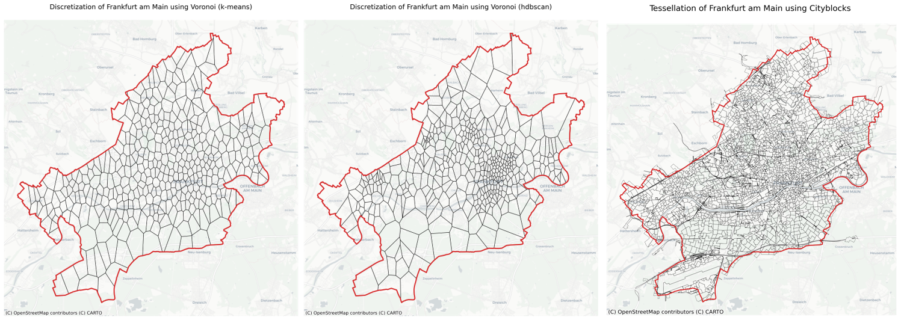

# Summary

Discretization of urban areas is a crucial aspect in many spatial analyses. It helps to understand geographical space and provides a framework for analyzing geospatial data [@gold:2016]. The process of discretization of space into subspaces without overlaps and gaps is called tessellation. The polygons, created using tessellation, are called tiles. Tiles can have the same shape and size (regular) or may differ in shape or size (irregular).

`TessPy` contains implementations of different tessellation methods for geographical areas and is designed to be flexible and easy to use. It is built on top of `GeoPandas` [@kelsey_jordahl_2019]. Tiles are returned in a `GeoDataFrame` in `shapely` [@shapely_software] `Polygon` format. Regular methods implemented here are squares (based on @Mercantile) and hexagons (based on @h3_uber). The implemented irregular tessellations are adaptive squares, Voronoi diagrams, and city blocks. The irregular methods are data-driven and the required data is retrieved from the OpenStreetMap (OSM) [@OpenStreetMap]. Points of Interest (POI) are downloaded using the `overpass` API, the official OSM API, to access the OSM database. To get the road network data, `osmnx` [@boeing:2017] is used (more info at @boeing_2017_2). The input can be in different formats, e.g., a `Polygon` (or a `Multipolygon`) with a defined coordinate reference system (CRS), or an address.  More methods and functions are explained in the API documentation. Several examples (e.g., clustering of urban areas) are demonstrated in `TessPy` documentation. Clustering algorithms within tutorials or methods use scikit-learn [@scikit-learn] and hdbscan [@hdbscan_2017]. Further packages for conducting spatial analyses in the tutorials are @esda_2021 and @libpysal_2021, which are subsets of @pysal_2022 (More info to be found at @rey2010pysal and @rey2021pysal).

Being extensive and flexible, `TessPy` allows the user to customize the tessellation methods. This is essential, especially when it comes to irregular methods. For example, different initial clustering algorithms can be used to define centroids in the Voronoi method. \autoref{fig1} shows three examples for irregular tessellations for Frankfurt am Main.

# Statement of Need

The first challenge in most of spatial analyses is defining a (statistical) unit to proceed with quantitative analysis (or, in other words discretizing the studied region). `TessPy` addresses the process of creating the units for spatial analysis. It uses tessellation to build the tiles, which are then defined as units. `TessPy` is extensive and flexible at creating these units since various tessellation methods are implemented and all the tessellation methods are customizable, e.g., by providing flexible spatial scaling [@thakur2021mapspace]. Therefore, it allows for many variations in generating these units. 

As @white:2008 argue, topology affects the outcome of geospatial models. Therefore, it is important to consider different tessellation methods while conducting spatial analyses. Regular tessellations are suitable for basic applications or when uniform/congruent tiles are required. For instance, @goovaerts:2000 uses square tessellation to analyze rainfall, and @asamer:2016 uses hexagons tessellation to optimize charging station locations for electric vehicles. The irregular tessellation methods are more sophisticated and complex. The created tiles are flexible and can adapt to the data structure depending on the spatial attribute. For example, @belej:2020 use Voronoi tessellation for geospatial analysis of real estate prices.

Regarding the available dataset and the characteristics of the studied variable, researchers in the filed of spatial analyses can test and explore different topologies (different tessellation methods or different units) and finally achieve what, in that particular case, leads to the most efficient quantitative analysis. Besides tessellation, `TessPy` provides further functionalities. For example, users can combine spatial discretization with additional data, in this case POI data are assigned to each tile [@hagen:2022]. Overall, `TessPy` provides the framework for geospatial analyses. By using the retrieved POI data and the created tiles, it allows further analyses. 

# Example Usage 

Assume we have a dataset of real estate prices in Berlin. It contains locations and the corresponding prices. Visualizing this dataset (retrieved from ImmoScout24[^1]) results in \autoref{fig2} (left), which does not indicate any insight into the real estate prices in Berlin. To start any quantitative analysis, we need first to define the units. We can do this by tessellating Berlin using `TessPy`, as shown in \autoref{fig2} (right). In this case, we create a square grid. This is the prerequisite for any statistical analysis.

Statistical analyses such as a heatmap of prices \autoref{fig3} (left) or a test for spatial autocorrelation can be conducted based on the created tiles. \autoref{fig3} (right) shows the spatial lag of the price, which is considered a key element in many spatial analyses and shows the behaviour of the studied variable in the neighbour units (by creating a mean value).

All the above analyses can be demonstrated using another tessellation method, such as Voronoi polygons, with just a few lines of code. This simplicity of `TessPy` offers the user the opportunity to easily find the most suitable method to build the quantitative units for further steps.

Using `TessPy`, the number of different POI categories in each unit can be calculated. For example, a dataset with the number of restaurants in each tile can be created, and by merging this information, we can investigate if there is a correlation between the number of restaurants and real estate prices. Using `TessPy`, all the POI data can be retrieved to even build a model to explain or predict an outcome variable (such as the price).

# Related Software Packages

@fleischmann:2019 published `momepy`, a package for urban morphology, with the main purpose of quantitative analysis of urban forms. Using `momepy`, the user can generate a building-based morphological tessellation using Voronoi diagrams. This can be used, for example, to calculate which ratio of each tile is covered by a related building. However, this is only a special case of tessellation (Voronoi diagrams and buildings as generators). Moreover, created tiles may not cover the whole defined area since it tessellates the buffered building center points. `momepy` is not developed for geographical tessellation and none of the tessellation approaches of `TessPy` for geographical areas is mentioned by or implemented in `momepy`. 

There are further python packages that provide tessellation. For example, `tessagon` [@tessagon_software] is a package for the tessellation of 3D surfaces using triangles, hexagons, and more (to use in 3D printers).  `Pytess` [@bahgat_2022] tessellates space using Delauney triangulation and Voronoi polygons based on points’ coordinates. `libpysal` can determine finite Voronoi diagram for a 2-d point set. NURBS-Python (geomdl) [@bingol2019geomdl] is a pure python package that offers triangular and quadrilateral tessellations. Tessellation frameworks are not limited to python. The `sf` package [@sf_package_2018] in R provides a set of tools for working with geospatial vectors and can create a square or hexagonal grid covering the bounding box of a geometry. `spatstat.geom` is a subset of `spatstat` [@spatstat_package_2005], which is another package in R that supports geometrical operations and creates a grid of rectangles for a given spatial region. `bleiglas` [@Schmid:2021] is also an R package that provides tessellation functions. It makes 3D tessellation using point clouds as a mean for data visualisation and interpolation. In Julia, the package `VoronoiDelaunay` [@VoronoiDelaunay_jl_2022] provides 2D Delaunay and Voronoi tessellations on generic point types.

A common aspect of the most of the above mentioned packages is their focus on geometry-based tessellation. However, `Tesspy` is distinguished due to its geographical tessellation capabilities. A further unique characteristic of `Tesspy` is creating POI-based tiles and also city blocks. 

# Acknowledgements

`TessPy` is the result of the research project [ClusterMobil](https://www.frankfurt-university.de/de/hochschule/fachbereich-1-architektur-bauingenieurwesen-geomatik/forschungsinstitut-ffin/fachgruppen-des-ffin/fg-neue-mobilitat/relut/forschungsprojekte-relut/clustermobil/) conducted by the [Research Lab for Urban Transport](https://www.frankfurt-university.de/en/about-us/faculty-1-architecture-civil-engineering-geomatics/research-institute-ffin/specialist-groups-of-the-ffin/specialist-group-new-mobility/relut/). This research project is funded by the state of Hesse and [HOLM](https://frankfurt-holm.de/) funding under the *Innovations in Logistics and Mobility* measure of the Hessian Ministry of Economics, Energy, Transport and Housing. [HA Project No.: 1017/21-19]

# References

[^1]: https://www.immobilienscout24.de/