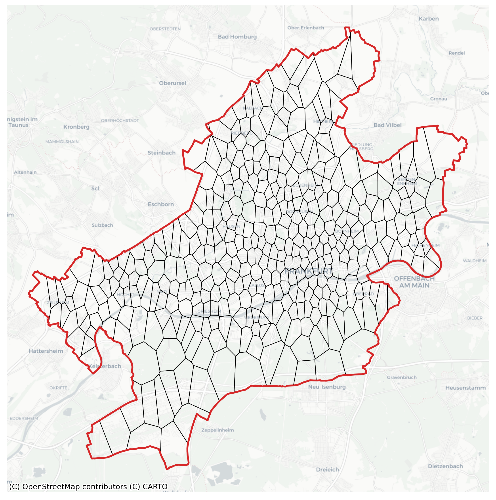

# Summary

Discretization of urban areas is a crucial aspect in many spatial analyses. It helps to understand geographical space and provides a framework for analyzing geospatial data [@gold:2016]. The process of discretization of space into subspaces without overlaps and gaps is called *tessellation*. The polygons, created using tessellation, are called *tiles*. Based on the tiles, tessellation methods can be grouped into regular and irregular. In regular tessellation methods, tiles have the same shape and size. Tiles created by irregular tessellation methods may differ in shape or size.

`TessPy` contains an implementation of different tessellation methods for geographical areas. It is built on top of `GeoPandas` [@kelsey_jordahl_2019]. Tiles are returned in a `GeoDataFrame` in `shapely` [@shapely_software] `Polygon` format. The required data for irregular tessellation methods is retrieved from the OpenStreetMap (OSM) [@OpenStreetMap]. Points of Interest (POI) are downloaded using the `overpass` API, the official OSM API, to access the OSM database. To get the road network data, `osmnx` [@boeing:2017] is used. The input can be in different formats. It can be a `Polygon` (or a `Multipolygon`) with a defined *coordinate reference system* (CRS), or an address. In case of an address, the area is retrieved from the OSM using `Nominatim`.

After defining the area, tessellation can be done using the implemented methods. Regular methods, implemented here, are squares and hexagons. Squares are created based on the Microsoft Bing Maps Tile System. This uses the `Mercator` projection and `quadkeys` for indexing and storage of tiles. Hexagons are created based on the Uber h3 grid system. In contrast to squares, hexagons have equal distance to the neighbor polygons, where distance is calculated as the distance of center points. In square and hexagon methods, the size of polygons is adjusted by setting a resolution.

The implemented irregular tessellations are adaptive squares, Voronoi diagrams, and city blocks. These methods are based on geospatial data retrieved from the OSM database. For example, in adaptive squares, an initial square grid is generated. Next, the specified POI are fetched from the OSM. POI are then counted for each square. Finally, if the number of POI exceed a certain threshold, the square is subdivided into four *children squares*. This process is done until the POI counts of all the squares are within the defined threshold.

In the Voronoi diagrams method, POI are used to generate Voronoi cells. POI can be directly set as generators. For example, if public transport locations are used as generators, each polygon consists of the area with all the points closer to the corresponding public transport station. In case of *too* many POI, they can be clustered. Generators are then defined as centroids of the clusters. The main characteristic of this method is that the created tiles tend to be smaller where the POI are dense and larger where POI are sparse. \autoref{fig1} shows an example of Voronoi tessellation for the city of Frankfurt am Main in Germany, based on the POI categories: `amenity`, `public_transport`, `building`, `shop`, and `office`.

Different definitions of city blocks exist. In the context of `TessPy`, they refer to the area surrounded by the street segments. This method retrieves the road network of the area. Using the street segments, the smallest city block units are created. By defining the desired number of polygons, the algorithm merges the contiguous small polygons. This prevents traffic islands from ending up as final tiles. In addition, road types can be defined to modify the fineness of city blocks. For certain urban analyses, city blocks may provide significantly better results as they capture the city's structure more realistically.

This summary explains only a high-level functionality of `TessPy`. More methods and functions are explained in the API documentation. Several examples (e.g., clustering of urban areas) are demonstrated in `TessPy` documentation.

In `TessPy`, only open-source data from the OSM is used to generalize the methods to (almost) any geographical area. In addition, all the implemented models are scalable to discretize metropolitan regions or even countries.

# Statement of need

As @white:2008 argue, topology affects the outcome of geospatial models. Therefore, it is important to consider different tessellation methods while conducting spatial analyses. Regular tessellations are suitable for basic applications or when uniform/congruent tiles are required. For instance, @goovaerts:2000 uses square tessellation to analyze rainfall, and @asamer:2016 uses hexagons tessellation to optimize charging station locations for electric vehicles.

The irregular tessellation methods are more sophisticated and complex. The created tiles are flexible and can adapt to the data structure depending on the spatial attribute. For example, the adaptive squares method creates larger polygons where data is sparse, resulting in fewer final tiles (compared to squares) and better performance when it comes to computation time. In Voronoi diagrams, the distribution of data in tiles is more systematic and can be partially controlled by adjusting the desired number of tiles. For example, @belej:2020 use Voronoi tessellation for geospatial analysis of real estate prices.

City blocks could exhibit a high performance by determining different functional zones of an urban area since the border between tiles is defined by streets. For example, @zheng:2011 use city blocks for analyzing GPS trajectories of taxis.

TessPy provides the framework for geospatial analyses. Moreover, by using the retrieved POI data and the created tiles, it allows further analyses. 

# Acknowledgements

`TessPy` is the result of the research project [ClusterMobil](https://www.frankfurt-university.de/de/hochschule/fachbereich-1-architektur-bauingenieurwesen-geomatik/forschungsinstitut-ffin/fachgruppen-des-ffin/fg-neue-mobilitat/relut/forschungsprojekte-relut/clustermobil/) conducted by the [Research Lab for Urban Transport](https://www.frankfurt-university.de/en/about-us/faculty-1-architecture-civil-engineering-geomatics/research-institute-ffin/specialist-groups-of-the-ffin/specialist-group-new-mobility/relut/). This research project is funded by the state of Hesse and [HOLM](https://frankfurt-holm.de/) funding under the *Innovations in Logistics and Mobility* measure of the Hessian Ministry of Economics, Energy, Transport and Housing. [HA Project No.: 1017/21-19]

# References

